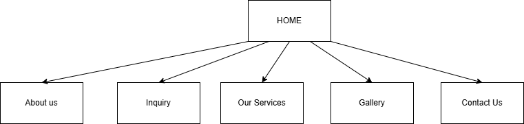

# Project Title
Vukani Website

## Student Information
**Student number:** ST10513411  
**Student Name:** Nceba Nyangiwe

## Project Overview
Brief History
Vukani Care was established in 2000 by a group of 60 community members who identified a serious gap in awareness and support around tuberculosis (TB) and HIV/AIDS in the Kokosi community. From its founding, the organisation prioritized Direct Observe Treatment Short (DOTS) support, community information dissemination, and family empowerment education. Ragoga supports services assisted int the formal programme launches in March 2005, anchored at EXT 4 Sehudi Street No.4267, Kokosi.The programme has since grown significantly. Today,42 members coordinate daily activities covering psychological support, community awareness campaigns, HIV testing services, condom distribution, health education, linkage to care, and Voluntary Medical Male Circumcision {VMMC} outreach (South African Department of Health,2023).
Vision:
To provide comprehensive home-based care including symptomatic relief, psychological support, and spiritual comfort to patients cared for at home in the Kokosi Community.
Mission:
The organisation strives to render available services, protect the welfare of all who seek its assistance, and apply member skills in ways that are fully aligned with the ethical principles of home-based care.
Target audience:
•	Caregivers, family members, and household guardians of patients
•	Abused children who are HIV/AIDS affected and require care and support
•	Potential donors, grant making organisations, and corporate sponsors
•	Governmental health departments referral institutions 
•	NGO partners, volunteers, and general public seeking health resources
•	Community members in Kokosi living with or affected by HIV/AIDS and TB

## Website Goals and Objective
Website goals and objectives 
•	Build a credible professional digital presence that reflects the organization’s values and work.
•	Provide accessible accurate information on TB, HIV/AIDS, and home-based care services (Google,2026).
•	Attract and retain donors and grant funders by showcasing impact and transparency.
•	Enable online volunteer registration and community participation. 
•	Services as a central information hub for news, events, reports, and resources(Wordpress.org.2026).

Key Performance Indicators (KPIs)
KPI and Target/Measure
Monthly unique visitors: 200 oer month within 6 months of launch
Donor/Funding inquiries: 3+ inquires per quarter via website
Volunteer Sign ups: 5+ registration
Bounce rate: Below 50%
Page Load speed: Under 3 seconds on mobile networks
Aceessability Score: WCAG 2.1 AA complience of 90% 

## Timeline and Milestones
Date and Milestone/Task
11 April 2026: Research
12 April 2026: Planned the website structure and identified 
Required pages (Home, About Us, Service, Gallery,
Contact)
13 April 2026	Set up project folders in VSCode ( html, images, js and CSS)
14 April 2026: Created the basic html structure and navigation bar
Linking all pages
15 April 2026: Developed the Home page and added initial content
16 April 2026: Worked on About Us page and Added mission and vision statement
17 April 2026: Built the Services page and structured service service sections
Created the Gallery page and added image layout
Structure
18 April 2026: Developed the Contact us page and added contact form elements
19 April 2026: Tested all pages, fixed, errors, and prepared project for submission

## Sitemap

## References

Reference List
•	Afrihost. (2026). Web hosting plans and pricing
•	Google. (2026). Google Analytics 4(GA4)-measurement system. Retrieved from https://analytics.google.com
•	Hertzner South Africa. (2026).Domain and hosting solutions. Retrieved from https://www.hertzner.co.za
•	South African Department of Health. (2023). National HIV, TB and STI strategic plan 2023-2028. Retrieved from https://www.health.gov.za

